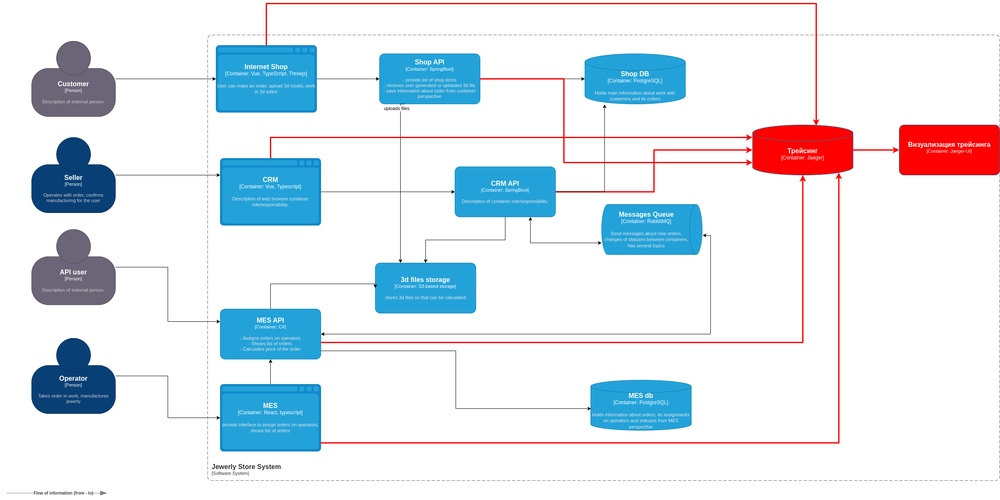

# Анализ
Трейсингом покрываем системы: Shop API, CRM API, MES API, Messages Queue, 3d files storage, Shop DB

Трэйсинг должен включать данные:
* идентификатор трэйса
* идентификатор пользователя
* идентификатор заказа
* сервис который посылает запрос
* сервис в который посылаем запрос
* время запроса

В любом месте в системе заказ может сломаться или зависнуть.

# Мотивация
Технические метрики:
* Позволит определить время взаимодействия между компонентами системы, что позволит ускорить систему
* Позволит определить в каком месте происходят ошибки между компонентами, что позволит оперативно их исправлять

Бизнес-метрики:
* Среднее время выполнения заказов
* Уменьшение жалоб от клиентов

# Предлагаемое решение
Предлагаю использовать Jaeger как один из популярных инструментов трейсинга.

Для просмотра трейсов используем Jaeger-UI

[Диаграмма](tracing_jaeger.drawio)

# Компромиссы
* Не во все системы можно внедрить трэйсинг, например базы данных, очереди, S3 хранилище
* при большом количестве заказов, будет храниться большой объем данных трассировки, что приведет к дополнительным затратам
* для добавления в MES сбор трэйсов, может потребоваться дополнительные затраты на разработку, так как это сторонне приложение в котором необходимо разбираться

# Аспекты безопасности
Аутентификация пользователя для просмотра трэйсов будет только для сотрудников компании с нужными правами, протокол HTTPS
