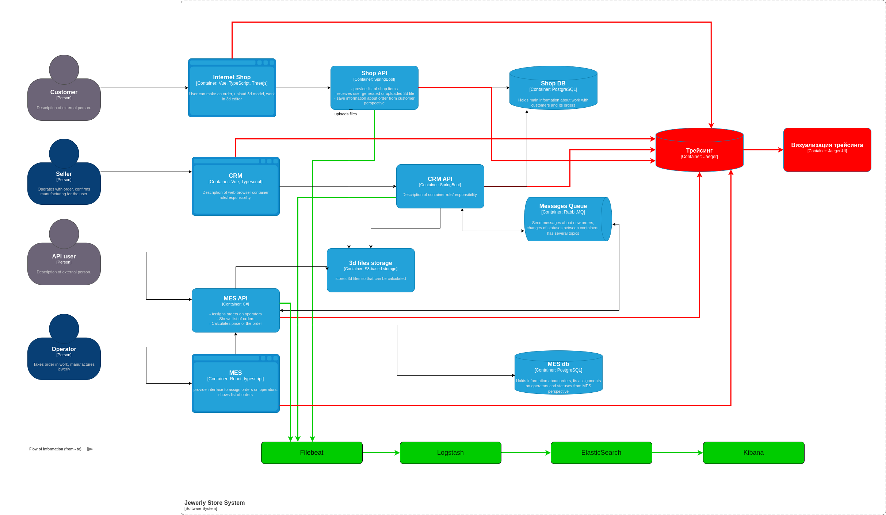

[Диаграмма](elk.drawio)

# Собираемые логи
### INFO
Пишем логи по созданию заказов, их изменение. Обработка заказов продавцами.

### WARN
Тут пишем проблемы аутентификации, таймауты ответов от сервисов между собой, не корректная валидация данных в сервисах

### ERROR
Тут пишем ошибки в сервисах и их взаимодействия между другими сервисами, ошибки соединений с базой, очередями S3 хранилищем.

# Мотивация
Логирование необходимо для быстрого выявления ошибок в системе и анализа для принятия решений.

Влияние внедрения логирования:
* Своевременное обнаружение ошибок в системе
* Можно оценить процент удачный и не удачных заказов
* оценить время взаимодействия сервисов 
* среднее общее время выполнения заказа
* поможет для бизнеса контролировать работоспособность системы и сократить сбои и быстро их устранять, в следствии получать больше выполненных заказов и прибыли

# Предлагаемое решение
Предлагаю использовать стек ELK. Используем Filebeat для сборки логов из сервисов.

Для безопасности не храним конфиденциальную информацию и личные данные пользователя, если они важны для дальнейшего анализа, то можно использовать маски для этих данных.
Доступ к логам будут иметь разработчики и DevOps.

Индексы ограничим в 20Гб, для каждой системы будет отдельный индекс. Хранение будет 1 месяц, если в дальнейшем нужен какойто анализ производиться то хранение можно увеличить.

# Алерты
Уведомления настраиваем для критичных ошибках.

Также настраиваем важные уведомления:
* Большой рост запросов к сервисам больше заданного порога в процентном соотношении, возможно атака
* долгая обработка заказов выше средней на определенный процент
* рост не выполненных заказов
* ответы от сервисов стали выполняться дольше среднего на определенный процент
