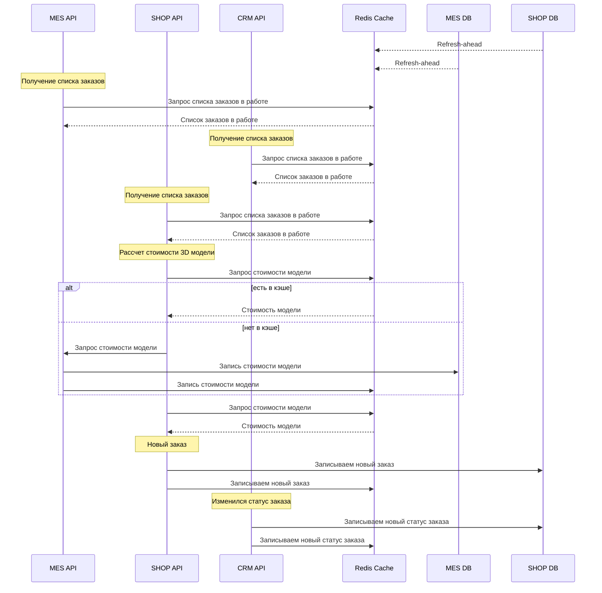

# Мотивация
Кэширование нужно потому что у компании уже есть проблемы с медленной работой сервисов. С ростом пользователей эта проблема станет еще больше.

Добавление кэша сильно экономит средства компании, так как можно сильно уменьшить нагрузку на сервисы, нежели масштабировать сервисы горизонтально или вертикально.

# Анализ и предлагаемое решение
В систему нужно добавить следующие кэши:
* Кэшировать для MES запросы на рассчет стоимости 3D модели по их хэшу например, если такую модель уже рассчитывали ранее,
  используем стратегию Refresh-ahead.
  Надо точно смотреть что за данные передаются, возможно по другим признакам определять и выбирать стратегию кэширования другую
* Кэшировать отдельно каждый заказ который находится в статусах "в работе". К этим записям можно будет обращаться как
  из CRM так и пользователи с сайта, по идентификатору заказа. Используем стратегию Refresh-ahead (для периодического
  обновления, больше нужно для синхронизации и прогрева кэша) и Write-Through для обновления сразу и в базу и в кэш, чтобы кэш всегда был актуален.
* Кэшировать для MES список новых заказов. Используем стратегию Refresh-ahead (для синхронизации) и Write-Through для актуальности кэша без задержек.

Инвалидация по сути выполняется периодическим обновлением состояний по Refresh-ahead а Write-Through служит для
актуальности состояния кэша без задержек.

Используя сразу 2 механизма Refresh-ahead и Write-Through кэш будет всегда в актуальном состоянии.

Дополнительно посоветовал бы внедрить технологию WebSocket которая позволяет избавиться от большого количества запросов к сервисам 
для обновления состояний заказов, тем самым можно еще сократить нагрузку на сервисы. 
Всем подписанным клиентам будут приходить обновленные статусы сразу как только статус меняется в сервисах, 
из за чего можно еще более эффективно работать с заказами и быстрее реагировать.

# Предлагаемая схема работы кэша

[Изображение схемы](cache_diagram.png)

